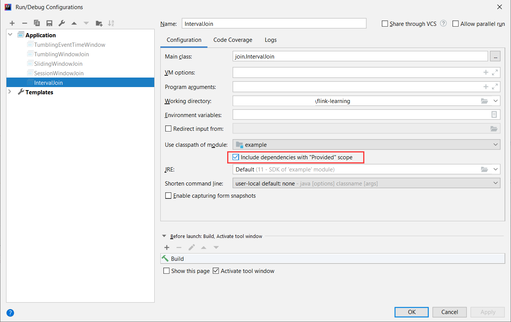

# flink-learning

Examples to validate understanding of Flink.

Run in IntelliJ IDEA:
* Scripts in `examples/src/`.
* `examples/fraudDetection`.
* `useCase/accumulatedAggregation`.

Assemble and run in server: 
* All other projects.

## Use cases

1. How to split data stream by key and write each sub-stream to sink, e.g., to a separate folder (like partitionBy in Spark)
    
    Use `KeyBucketAssigner`. 
    
    Write text file to local filesystem: See https://github.com/largecats/flink-learning/blob/main/useCase/splitStreamByKeyLocalFs/src/main/java/SameSchema.java.
    
    Write parquet to HDFS: See https://github.com/largecats/flink-learning/tree/main/useCase/splitStreamByKeyHdfsParquetSameSchema.
    
2. Must all sub-streams be written out using the same schema? Or we can specify different schemas for each sub-stream?

    Can manually specify different schemas for each sub-stream. 
    
    Write text file to local filesystem: See https://github.com/largecats/flink-learning/blob/main/useCase/splitStreamByKeyLocalFs/src/main/java/DifferentSchema.java.
    
    Write parquet to HDFS: See https://github.com/largecats/flink-learning/tree/main/useCase/splitStreamByKeyHdfsParquetDifferentSchema.
    
3. When reading from Kafka topics, how to increase parallelism before or while reading data (so `rebalance()` won't help much) besides increasing the topic's partitions?
    
    There is no built-in method to do this.

    Possible workarounds:
    1. In Structured Streaming, this can be done as follows (see [here](https://github.com/largecats/structured-streaming-learning/blob/main/useCase/autoScaling/src/main/scala/Main.scala)):
        1. In each microbatch, read in data as stream DF to get the offset range.
        2. Take advantage of batch DF's `minPartitions` option to increase parallelism by splitting the offset range (but the watermark feature is lost).
        Not sure if something similar is possible in Flink, see https://stackoverflow.com/questions/68031231/equivalent-of-structured-streamings-minpartitions-in-flink-kafka-source.
    2. Define custom Kafka source.
        * Logic would be similar to the first approach, and we need to implement many things ourselves.
    
4. How to split one Kafka topic into multiple topics?

    Implement `KafkaSerializationSchema`. Its method `serialize`'s return type is `ProducerRecord`, which allows specifying the topic and partition for each record.
    
    See https://github.com/largecats/flink-learning/tree/main/useCase/splitKafkaTopic.
    
    1) The `FlinkKafkaProducer` constructor requires topic name, so how does this topic interact with the topic specified in `ProducerRecord`?
    Will it be overwritten?
        
        Yes, the topics specified in `KafkaSerlizationSchema` will override the default topic provided at the definition of `FlinkKafkaProducer`.
        See source code https://github.com/apache/flink/blob/a7f31926eced15fa2df353b06c71b86c4f9a8e0c/flink-connectors/flink-connector-kafka/src/main/java/org/apache/flink/streaming/connectors/kafka/FlinkKafkaProducer.java#L852.
        
## Troubleshooting

### Unable to initialize main class

**Issue**


**Solution**

Go to Run >> Edit Configurations:


Tick "Include dependencies with 'Provided' scope".


Also see https://ci.apache.org/projects/flink/flink-docs-release-1.13/docs/try-flink/datastream/#running-in-an-ide.

### -target:jvm-1.8
**Issue**

When running https://github.com/largecats/flink-learning/-/tree/main/example/fraudDetection/src/main (or using `WatermarkStrategy` in Scala in general), may encounter this error:
```
Static methods in interface require -target:jvm-1.8
                .forBoundedOutOfOrderness(Duration.ofSeconds(0))
``` 
**Solution**

Go to File >> Settings >> Build, Execution, Deployment >> Compiler >> Scala Compiler and set as follows:

